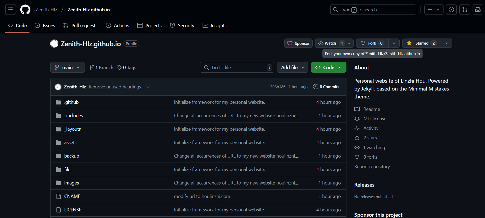
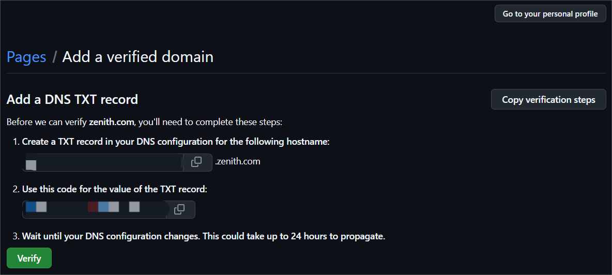

## 个人网站搭建指南

> Philosophy：极简、高效、免费

<br>**如何搭建属于自己的轻量化网站？**

---

### (0) 核心工具

在开始之前，首先介绍一下本站所依赖的核心工具

- [Jekyll](https://www.jekyll.com.cn/)：一个简单的静态网站生成器。Jekyll 允许你使用 Markdown 或 Liquid 模板语言来编写内容，并将其转换为静态 HTML 文件。它非常适合用于博客和文档网站，支持插件扩展功能，能够轻松集成各种功能。
- [Minimal Mistakes](https://mademistakes.com/)：本站所采用的极简风主题。Minimal Mistakes 提供了丰富的布局和样式选项，支持响应式设计，能够在各种设备上良好显示。它还集成了许多 Jekyll 插件，简化了站点的配置和管理。
- [Github Page](https://docs.github.com/zh/pages)：GitHub 所提供的一个网页寄存服务。通过 GitHub Pages，你可以免费托管静态网站，并且与 GitHub 仓库无缝集成，支持自动化部署和版本控制，非常适合个人博客和项目文档。

---

### (1) 前期配置

接下来，我们先进行前期环境配置工作。万事开头难，读工科的同学都知道，往往配置代码编译环境是最繁琐的。一旦完成，后续的工作流将会非常顺滑，接下来请大家务必按照以下流程进行操作：

- 登录[GitHub](https://github.com)，创建一个新的仓库。将仓库命名为 `username.github.io` ，其中 `username` 替换为你的 GitHub 用户名。 例如，如果用户名为 `Zenith-Hlz`，则存储库名称应为 `Zenith-Hlz.github.io`。
- 如果你觉得从零开始搭建仓库有点困难，可以直接fork笔者的[仓库](https://github.com/Zenith-Hlz/Zenith-Hlz.github.io)，然后根据自己的需求进行修改。具体操作如下：
    - ~~首先，点击右上角的Star，支持笔者的工作~~ 🥰
    - **关键步骤：** 点击右上角的`Fork`，进入 Fork 配置界面。
    - 将 Repository name 配置为：`[你的用户名].github.io`
    - **注意：** 确保用户名和仓库名称中的大小写完全一致！
    - 勾选 Copy the `main` branch only（只需要复制项目主支即可）
    - 最后，点击`Create fork`，完成代码仓库复制

<br>

<br>至此，恭喜你完成了整个配置流程的一半！如果在上述步骤中遇到了任何问题，记得善用 STFW (Search The Friendly Web) 的理念，多上网查阅相关资料并解决问题。

---

### (2) 文件解释

下面，我们开始针对仓库内容进行定制化的修改。首先需要向各位解释**仓库中各个文件和文件夹的作用：**

#### 根目录文件介绍

```bash
.根目录
├── _config.yml  网站的核心配置文件，几乎所有的修改都从这里开始。
├── *.md         Markdown 文件，构成了网站上的每个页面，例如首页、博客、关于页面等。
├── CNAME        用于绑定自定义域名。如果你有自己的域名（如 houlinzhi.com），可以通过此文件替代默认的 .github.io 地址。
├── LICENSE      代码仓库的协议文件。通常是 MIT 协议，表示该代码仓库可以被自由复制和修改。（可选配）
```

- `_config.yml`：这是 Jekyll 静态站点的“大脑”，决定了网站的标题、主题、导航、作者信息等内容。稍后我们会专门讲解如何配置这个文件。
- `*.md` 文件：根目录中的 Markdown 文件，比如 index.md 通常是首页内容的主体。通过 Markdown 的简洁语法，你可以轻松编写丰富的页面内容。
- `CNAME` 文件：如果你有自己的域名，将其添加到此文件中即可完成域名绑定。否则，可以直接使用 GitHub 提供的 [username].github.io 地址。
- `LICENSE` 文件：决定了代码的使用权限。选择合适的协议，不仅可以保护你的知识产权，还能为他人提供清晰的复用说明。

#### 仓库文件夹介绍

```bash
.根目录
├── _includes 构成本网站的html代码，不建议修改
├── _layouts  构成本网站的html代码，不建议修改
├── assets    美化本网站的css, less, js代码，不建议修改
├── backup    用于备份文件，以便于后续修改时可以参考
├── blogs     存放个人博客.md文件，以及对应的图片素材
├── file      存放简历CV等个人文件，用于设置访问链接
├── images    存放.jpg等媒体文件，用于设置访问链接
```

- **`_includes` 文件夹**：  
  包含网站的可复用 HTML 代码片段，比如页头、页脚、导航栏等。默认的 Minimal Mistakes 主题已经设置得很完善，通常无需改动。  
- **`_layouts` 文件夹**：  
  定义不同类型页面的 HTML 布局，比如博客页面、首页或自定义页面的样式。修改这些文件需要一定的 HTML 知识，建议结合主题文档操作。  
- **`assets` 文件夹**：  
  这里存放的是 CSS、LESS 和 JavaScript 文件，用于美化和增强网站功能。如果你想修改网站的颜色、字体等外观样式，可以编辑这里的文件。  
- **`backup` 文件夹**：  
  这个文件夹用于备份你的配置或重要内容。任何大改动前，建议将旧版本文件放在这里，便于恢复原样。  
- **`blogs` 文件夹**：  
  个人博客的主战场！每篇文章对应一个 `.md` 文件，通过 Markdown 格式书写，方便快捷。你还可以将博客图片放在此处，便于管理。  
- **`file` 文件夹**：  
  用于存放简历、研究论文、项目文档等个人文件。通过绝对路径链接后，访客可以直接查看或下载这些内容。  
- **`images` 文件夹**：  
  用于存放网站需要的图片资源，例如插图、徽标等。在引用图片时，推荐使用相对路径链接，既方便又可靠。  

---

通过以上介绍，我们已经了解了每个文件和文件夹的功能分工。这种清晰的组织结构是 Jekyll 的一大优点，让你即便是初学者，也可以快速上手。接下来，让我们着手对文件进行修改和定制化，打造属于你的独一无二的网站！

---

### (3) 个性化修改

理解了每个文件对应的功能之后，再进行个性化的修改，就变得容易许多了。大家可以注意到，其实当你fork完代码仓库，等待一段时间后，访问 `[你的用户名].github.io` 这个域名，此时网站已经可以运行了，只不过显示的还是笔者的网站内容。

<br>因此，接下来需要进行个性化的修改。需要注意的是，在这里笔者并不会教大家每个文件的具体配置，而是教你如何修改主要的文件，其他的则需要你自行按图索骥，举一反三。

<br>如果你没有属于自己的域名，可以直接使用`[你的用户名].github.io`这个域名，也是非常方便的。此时你就需要将代码中所有的 URL 改为你自己的`[你的用户名].github.io`，这样就可以实现网站的更新。如果你有自己的域名，我将在文章的后续部分介绍如何配置域名。

<br>首先我们修改`index.md`文件，也就是网站的主界面，在文本编辑完成后，上传到你的`github仓库`，一切正常的话，1-2分钟过后，你的网站就会发生变化了。其他的文件也是如此，只需要修改`.md`文件，然后上传到`github仓库`，就可以实现网站的更新。

<br>接下来，介绍`_config.yml`文件的配置方法。`.yml`是Jekyll静态站点的核心文件，核心的部分如下，其他的内容展示都先不用修改。笔者在`.yml`文件中已经撰写了比较详细的注释，如果还是不太清楚的话，建议`STFW (Search The Friendly Web)`

```yaml
title: Linzhi Hou
url: https://houlinzhi.com

owner:
  name: Linzhi Hou
  avatar: avatar.jpg
  bio: I am an Enthusiastic Computer Science and Technology student at THU. Passionate about coding, AI, and open-source projects.
  email: hlz23@mails.tsinghua.edu.cn
  github: Zenith-Hlz
  bilibili: 667036156
  zhihu: https://www.zhihu.com/people/lin-zhi-cang-qiong

links:
  - title: About Me
    url: /
  - title: Awards
    url: /awards/
  - title: Schoolwork
    url: /schoolwork/
  - title: Hobbies
    url: /hobbies/
  - title: Blogs
    url: /blogs/
```

<br>恭喜你已经学会了最关键的部分，完成了80%的工作，之后的内容编辑你应该可以举一反三，得心应手了。接下来，笔者还会针对一些重要的细节进行指导，这些细节都将在后续网站的运营过程中帮助你减少工作量，希望你可以认真看下去哦。

---

### (4) 图片链接配置

读者朋友应该发现了，本文中出现的所有图片都放置在`./images/`文件夹下，接下来会讲解如何应用和规范图片格式，帮助你在后期减少运营工作量。

<br>到这里，笔者要引入Jekyll静态站点的第一条哲学了：**一切都是有备而来**。

<br>这也是Jekyll得到轻量化的原因——**不需要后期调用，只关注前期配置**。因此，每一个页面中的文字、图片、链接，都需要提前配置完成，方便后期显示。

<br>聪明的你应该发现了，只需要引入“相对地址链接”，然后上传到Github仓库中，就可以完成图片媒体的配置。需要注意的是，有的同学可能知道“图床技术”，但对于个人站点而言，这类需要长期维护的网站，**强烈不建议使用第三方图床服务**。

<br>如果图片挂了，你需要花费**超大量的时间**来转移图片链接——别问笔者为什么清楚，“皆是一把辛酸泪”。另外，使用相对地址，网站的图片加载速度会比第三方服务快得多（20%-50%）

---

### (5) 文件链接配置

现在，聪明的你可能又发现了，在笔者的站点中，点击[This is my reference book](https://houlinzhi.com/files\CSAPP.pdf)，就可以跳转到CSAPP。

<br>于是，笔者要引入Jekyll静态站点的第二条哲学了：**站点世界，是由链接构成的**。

<br>这也是Jekyll得到轻量化的原因——**不需要后期调用，只关注前期配置**。因此，每一个页面中的文字、图片、链接，都需要提前配置完成，方便后期显示。

<br>上面说到，图片媒体的配置，可以通过“相对地址”（亦可以使用绝对地址），而这里的文件配置链接，**则必须使用“绝对地址”。**

<br>比如，在笔者站点中的`schoolwork.md`等页面中，都有超链接地址，可以直接访问`files`文件夹下的文件，这就是通过绝对地址实现的，下面是配置方法：

```markdown
[This is my file](https://houlinzhi.com/files\CSAPP.pdf)

[] 里面放置你想显示的内容文本
() 紧跟着，放置文件的绝对地址
```

这样，我们就完成了图片媒体和文档媒体的配置过程，现在你应该感到非常兴奋对吧？学习技术就是如此富有魅力的过程，今天又是收获满满的一天！

---

### (6) 自定义域名配置

最后，我们来讲解一下如何配置自定义域名。如果你有自己的域名，可以通过以下步骤将其绑定到 GitHub Pages 上：

- **Step 1：** 配置 GitHub Pages 的自定义域名

  - 打开你的 GitHub Pages 仓库，点击 Settings -> Pages，找到 Add a domain 选项。
  - 在输入框中填入你的域名，比如 `houlinzhi.com`，然后会出现一个验证页面：
    - 你需要在域名管理后台添加一个 TXT 记录，根据 GitHub 提供的提示进行配置。
    <br>
    - 等待 DNS 解析生效后，点击 Verify，验证通过后，你的域名就会绑定到 GitHub Pages 上。
  - 修改仓库中的 `CNAME` 文件，将其中的内容改为你的域名，然后上传到 GitHub 仓库。

- **Step 2：** 配置 DNS 域名解析

  - 打开你的域名管理后台，找到 DNS 解析设置，添加一个 CNAME 记录。
  - 将主机记录设置为 `www`，将记录值设置为 `[你的用户名].github.io`，保存设置。

    ```
    CNAME   www   Zenith-Hlz.github.io
    ```

  - 添加以下4条 A 记录，将主机记录设置为 `@`，将记录值设置为 GitHub Pages 的 IP 地址 

    ```
    A   @   185.199.108.153
    A   @   185.199.109.153
    A   @   185.199.110.153
    A   @   185.199.111.153
    ```

- **Step 3：** 更新网站配置文件

  - 由于个人网站基于 Jekyll ，需要修改 `_config.yml` 文件，将 `url` 配置为你的域名，然后上传到 GitHub 仓库。

    ```yaml
    url: https://houlinzhi.com
    ```

- **Step 4：** 验证域名解析

  - 等待 DNS 解析生效，打开浏览器，输入你的域名，应该可以看到你的个人网站了。

这样，你就成功将自己的域名绑定到 GitHub Pages 上了。如果你有多个域名，可以通过 CNAME 记录实现多域名绑定，具体操作可以参考 GitHub Pages 的文档。

---

### (7) 笔者的建议

结束上文，笔者还想谈谈在运营个人站点的过程中，自己踩过的一些坑，以及修改本站的注意事项。

<br>**第一，免费的才是最贵的**，正如笔者在最开始提到的Jekyll Philosophy——**极简、高效、免费**——然而，运营个人站点需要花费非常多的时间精力，需要学习相当多的新技术，需要跳出自己的舒适圈。所谓免费，皆是学习的成本。

<br>但与此同时，搭建个人站点的过程中，也可以学到许多课堂之外的知识，这些内容将在未来充分受用：markdown, Git, HTML, Bash等等。只要坚持学习，就永远跟得上最新的时代。

> What I cannot create, I do not understand.  ——Richard Feynman

**第二，不要畏惧写代码这件事**。我的建议是，永远不要停止学习，不要停止写代码。未来的世界将会有80%以上的研究者依赖于程序的能量，我们都见识过chatGPT的厉害了。所以，无论是`python`, `java`, `R`, `html`，抑或是`LaTeX`，趁早学会它们，都将在未来受益良多！

---

## 写在最后

最后的最后，感谢你阅读这份文字。如果笔者的博客成功帮助你完成了Jekyll个人站点的搭建，还请你给[本仓库](https://github.com/Zenith-Hlz/Zenith-Hlz.github.io)的右上角点一个`star`，鼓励我持续运营这个项目。

**谢谢你看到这里，我们后会有期！**

<br>

<p align="right">更新于2024年冬</p>