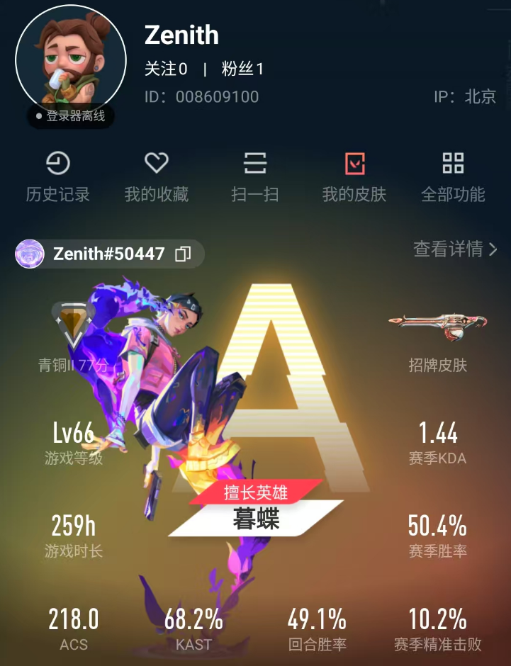
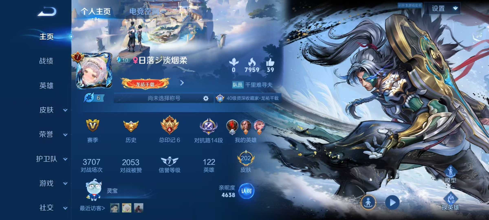
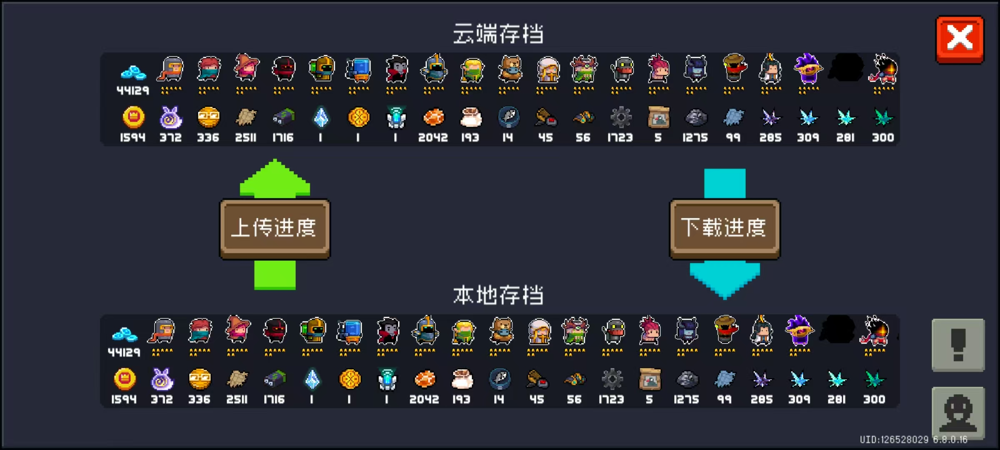

## Valorant

- [Valorant](https://playvalorant.com/)

   

  Valorant is a free-to-play multiplayer tactical first-person shooter developed and published by Riot Games. The game was first announced with the codename Project A in October 2019 and was released on June 2, 2020. Valorant is a team-based tactical shooter and first-person shooter set in the near future. Players play as one of a set of agents, characters designed based on several countries and cultures around the world. In the main game mode, players are assigned to either the attacking or defending team with each team having five players on it. Agents have unique abilities and use an economic system to purchase their abilities and weapons.

   

  I have been playing Valorant since summer of 2024. I am currently a Bronze 2 player and I am trying to improve my skills in the game. I have been watching a lot of professional players' streams and videos to learn from them. I am also trying to play with my friends to improve my teamwork and communication skills.

   

  **If you are interested in playing Valorant with me, feel free to add me on Valorant: Zenith#50447.**

   

  

---

## Honor of Kings

- [Honor of Kings](https://pvp.qq.com/)

   

  Honor of Kings is a multiplayer online battle arena game developed by TiMi Studios and published by Tencent Games. The game was first released in 2015 and has become one of the most popular mobile games in China. Honor of Kings is a fast-paced, competitive game that requires teamwork and strategy to win. Players can choose from a variety of heroes with unique abilities and playstyles. The game has multiple game modes, including 5v5, 3v3, and 1v1 modes.

   

  I have been playing Honor of Kings since 2016. I have reached the master rank in the game but now I have been paying less time on it. I still play the game occasionally with my friends and try to keep up with the latest updates and meta changes.

   

  

---

## Soul Knight

- [Soul Knight](https://play.google.com/store/apps/details?id=com.ChillyRoom.DungeonShooter)

   

  Soul Knight is a roguelike game developed by ChillyRoom. The game was first released in 2017 and has become one of the most popular mobile games in the world. Soul Knight is a fast-paced, action-packed game that requires quick reflexes and strategic thinking to survive. Players can choose from a variety of characters with unique abilities and weapons. The game has multiple game modes, including single-player and multiplayer modes.

   

  I have been playing Soul Knight since 2018. I have reached the highest level in the game and have unlocked most the characters and weapons. I still play the game occasionally to relax and have fun. I enjoy playing the game with my friends and trying out different characters and weapons.

   

  